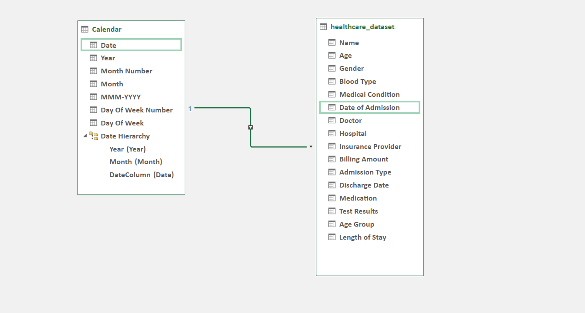
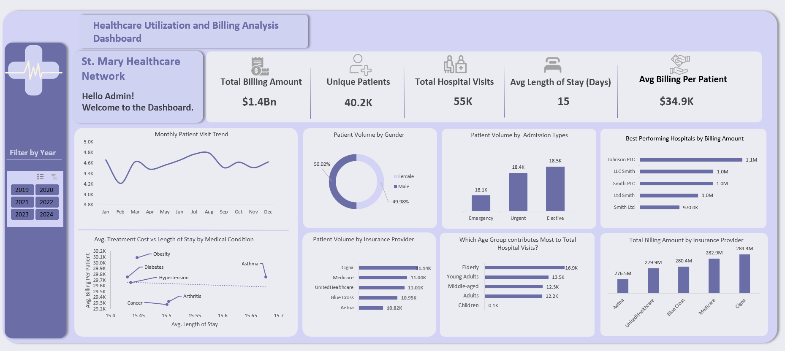

# Executive Summary
St. Mary’s Healthcare Network is a multi-department hospital network serving thousands of patients annually, providing comprehensive care across acute, elective, and specialty services. This project analyzed patient, admission, and billing data to uncover operational trends, cost drivers, and revenue opportunities. Key findings show the elderly age group accounts for the largest share of hospital visits, cancer cases are under-billed, asthma care is inefficient, and seasonal volume fluctuations stress staffing. Recommendations include investing in geriatric care, aligning staffing with seasonal demand, clarifying strategic focus, optimizing high-cost condition management, and maintaining insurer diversification aimed at improving efficiency, reducing costs, and enhancing patient outcomes.

## Introduction
St. Mary’s Healthcare Network is a fictional healthcare organization that serves thousands of patients annually across multiple departments. With rising healthcare costs and increasing patient demand, hospital leadership is seeking to enhance operational efficiency, cost management, and patient care outcomes through data-driven insights. Although historical patient admission and treatment data have been collected, they have not yet been analyzed to reveal actionable patterns. Leveraging this data can provide valuable insights into patient trends, hospital performance, and insurance-related impacts, enabling informed decision-making and strategic planning.

## Problem Statement
Hospitals struggle to efficiently manage resources, staff, and finances due to fluctuating patient volumes and varied insurance coverage. Dependence on specific insurers creates financial risk, while seasonal and demographic admission patterns strain operations. Without systematic data analysis, administrators may miss opportunities to optimize efficiency, control costs, and improve patient care. This project addresses these gaps by analyzing patient data to uncover trends, cost drivers, and operational insights to guide strategic decision-making.

## Objectives
The primary objective of this project is to analyze hospital patient data to generate actionable insights that enhance operational efficiency, financial planning, and patient care outcomes. Specifically, the project aims to:
* Analyze Seasonality: Identify patterns inpatient admissions throughout the year and assess their impact on staffing, bed capacity, and resource allocation.
* Examine Patient Volume Trends: Track changes in patient numbers over time, disaggregated by age group, gender, and admission type, to inform service planning.
* Investigate Cost and Length of Stay: Determine the factors driving average treatment costs and patient length of stay, highlighting opportunities for operational and financial optimization.
* Evaluate Insurance Impact: Assess patient volumes by insurer, identify potential revenue risks, and inform reimbursement strategy and financial planning.

## Data Overview
The dataset contains 55,000 records across 14 columns, capturing historical patient information including name, age, medical condition, admission and discharge dates, billing amount, admission type, insurance provider, room number, test type, blood group, medications, and attending doctor.
### Data Cleaning and Transformation
The dataset was imported into Power Query for cleaning and preprocessing to prepare it for analysis and modeling. Key transformation steps performed in Microsoft Excel using Power Query include:
* Removing Duplicates: Eliminated 1,500 duplicate entries.
* Handling Missing Values: Checked for missing data; none were found.
* Standardizing Inconsistent Data: Ensured uniform formats for dates and other fields.
* Converting Data Types: Converted fields to appropriate types.
* Filtering Irrelevant Data: Removed columns not required for the analysis.
* Creating Derived Columns: Added a conditional column for age groups and calculated patient length of stay (Discharge date – Admission date).
* Documenting Cleaning Steps: Maintained detailed records of all cleaning and transformation actions for transparency and reproducibility.
### Data Modelling
Once the data was cleaned in Power Query, it was loaded into the data model. A date table was created to enable time intelligence calculations. The date table was connected to dataset facts table.

### Calculated Fields and DAX Measures
A blank table was set up to store DAX measures, and key performance indicators (KPIs) were calculated using DAX. 
The data was analysed with Pivot Tables and DAX Measures using Power Pivot. The following KPIs were developed:
| KPI | Description |
|-----|-------------|
| Total Billing Amount | Sum of all charges billed to patients over a specific period; reflects overall hospital revenue from patient services |
| Unique Patients |Total count of individual patients who received care in the period; each patient is counted only once regardless of multiple visits |
| Hospital Visits | Total count of all patient visits, including repeat visits, measuring hospital activity and service demand |
| Average Length of Stay |Average number of days patients spend in the hospital per admission; calculated as total days of stay/ number of admissions |
| Average Billing per Patient | Average amount billed per patient; calculated as total billing/number of unique patients, indicating revenue generated per patient|

## Data Visualization 
A single-page interactive dashboard was developed to address stakeholder questions comprehensively. It provides an overview of KPIs, highlighting growth rates, monthly patient visit trends, and patient distribution by gender, age group, admission type, and insurance provider.
### Dashboard Preview:

[Download the Dashboard](./Project_Dashboard/Project_Dashboard.xlsx)

## Insights 
The following insights are drawn from the analyzed patient data, highlighting key trends in operations and patient volume,. These findings provide actionable guidance for strategic planning, resource allocation, and financial decision-making.
* The network manages 40,200 unique patients across 55,000 total hospital visits, generating $1.4 billion in total billing equating to an average of $34,900 per patient. This reflects a high-revenue, moderate-volume operating model, with a relatively prolonged average length of stay of 15 days, indicating significant resource utilization per case.
* Monthly visit volumes fluctuate by approximately 21%, with peaks in January and mid-year and a trough in early Q4. This variability is operationally significant; maintaining static staffing levels creates predictable inefficiencies such as capacity shortages and staff burnout during peak periods, and excess labor costs during low-demand months. The absence of a dynamic, seasonal staffing model is a structural inefficiency.
* The virtually identical male–female split (approximately 50/50) indicates equitable access to care across genders. From an operational standpoint, this removes the need for gender-targeted capacity planning and suggests that demand patterns are broadly uniform across the patient base. 
The near-equal distribution across Emergency, Urgent, and Elective admissions; combined with the fact that approximately 66% of visits are demand-driven (Emergency + Urgent) points to a lack of clear strategic positioning. This ambiguity likely results in suboptimal allocation of resources, as the network is simultaneously attempting to function as an emergency hub, urgent care system, and elective care center without prioritization. 
The elderly age group (65+) contributes approximately 31% of total visits. In parallel, the near-zero pediatric volume highlights a clear underdeveloped service line, representing both a strategic gap and missed revenue diversification opportunity. 
* Cancer despite being the most resource-intensive condition generates the lowest average billing, signaling potential reimbursement constraints or under-capture of billable services. Asthma records one of the longest average lengths of stay approximately 15.65 days) but sits below the top billing tier (approximately $29K). This indicates a low-to-moderate revenue yield relative to resource consumption, making it operationally inefficient compared to conditions like obesity.  From a margin perspective, asthma likely represents a cost-pressure condition, where extended hospitalization is not matched by proportional billing. This points to potential gaps in inpatient management efficiency, discharge processes, or pre-admission disease control.
* The payer distribution data shows a tightly clustered billing range (2.8%) and no single insurer contributing more than ~21% of revenue. This indicates a highly diversified and resilient revenue structure, minimizing exposure to single-payer shocks. From a strategic standpoint, this should be treated as a strength to preserve, not a variable to optimize aggressively.

## Recommendations
Based on the insights derived from the patient data, the following recommendations are proposed to optimize hospital operations, enhance patient care, and strengthen financial planning. These actions are designed to address identified trends, mitigate risks, and support data-driven decision-making.
* Align workforce and capacity planning with seasonal demand patterns: Transition to a dynamic staffing model based on demand cycles, with defined Peak, Standard, and Trough operating modes. This enables cost optimization during low-demand periods and capacity reinforcement during high-demand months, reducing both burnout risk and idle resource cost. Embed a rolling 12-month forecasting model and refine annually using historical utilization trends.
* Optimize geriatric care delivery and evaluate pediatric expansion:
Expand geriatric-focused services with multidisciplinary pathways, dedicated beds, and early discharge planning to improve LOS, efficiency, and patient outcomes. In parallel, conduct a feasibility assessment for pediatric services to determine whether current low volume reflects unmet demand, access barriers, or demographic constraints. 
* Define strategic focus through admission-level profitability analysis: Conduct a full cost-to-serve and margin analysis across Emergency, Urgent, and Elective admissions to establish the network’s most economically viable service mix. Use this to drive a clear strategic positioning—either scaling elective services (if higher margin) through dedicated scheduling pipelines, or strengthening emergency care infrastructure and triage systems to efficiently manage the dominant unplanned demand base. 
* Institutionalize equity monitoring through data-driven governance: While topline gender parity is strong, deeper analysis is required to validate equity in care delivery. Execute a stratified utilization review across key dimensions (admission type, condition, age, department) and formalize findings into an annual Gender Equity Scorecard to ensure consistency in access, outcomes, and resource allocation. 
* The network should focus on revenue optimization for cancer care by auditing coding accuracy and ensuring all billable services including diagnostics, oncology medications, and procedures are fully captured. Payer contracts should be reviewed to confirm reimbursement rates reflect the true cost of care, and renegotiation pursued where rates are underpriced. For asthma, the priority is reducing length of stay. This can be achieved through standardized exacerbation management protocols and early discharge criteria, complemented by strengthened outpatient follow-up programs to ensure adherence to controller therapy and post-discharge monitoring within seven days. Performance should be tracked with a target of reducing average length of stay by 1–2 days within 6–12 months.
* The Network should preserve payer diversification while proactively managing contract risk. The narrow 2.8% billing spread across insurers and absence of payer concentration (>21%) reflects a well-balanced revenue base with low dependency risk. This should be actively maintained by enforcing a ceiling (≤25% per payer) and instituting annual payer mix reviews. Particular attention should be placed on early warning signals e.g., declining volumes or billing from lower-performing payers to pre-empt renegotiation or contract attrition risks. 

## Limitation
The analysis is limited by the use of a fictional dataset, which may not fully capture real-world patient behavior, operational dynamics, or billing patterns. Additionally, certain patient attributes, external factors, and detailed treatment outcomes were not included, which may constrain the comprehensiveness and applicability of the insights.

## Conclusion
The analysis provided clear insights into patient trends, operational efficiency, and total billing patterns. These findings equip the hospital with actionable guidance for strategic planning and data-driven decision-making.

